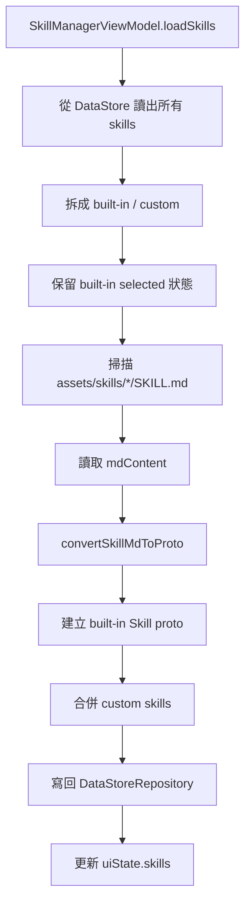
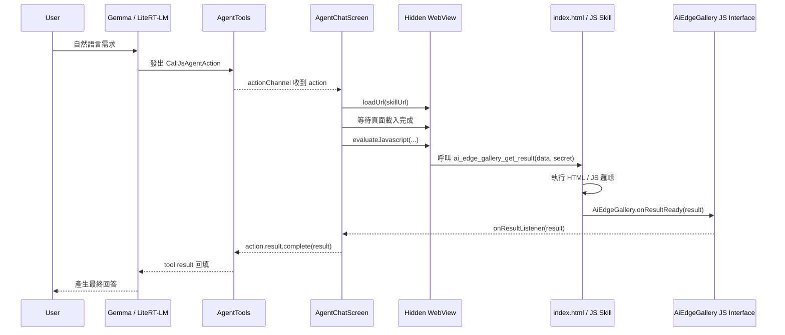
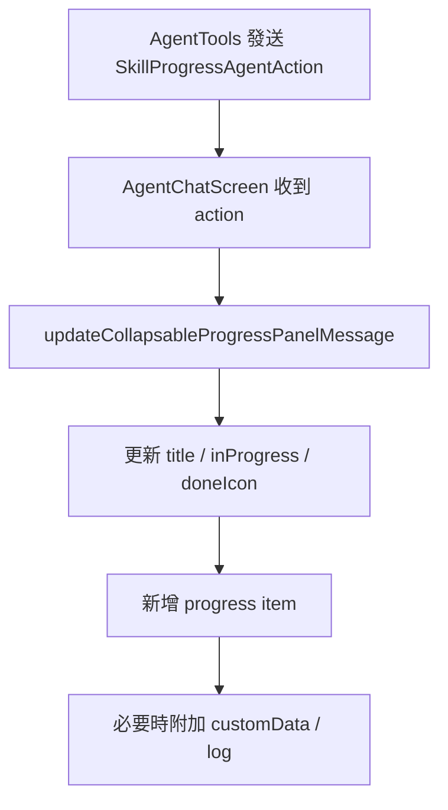
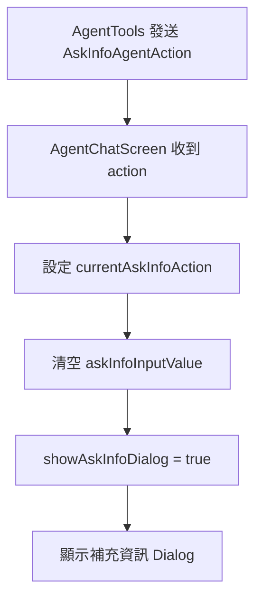
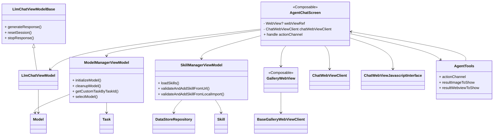
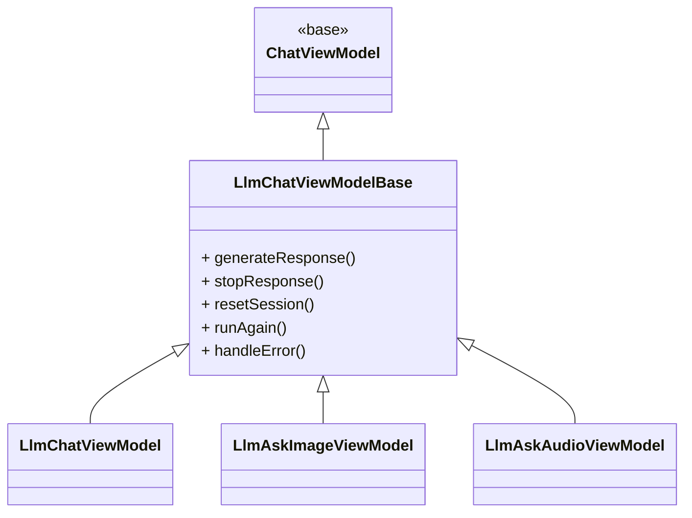

# Android 上的 Gemma Agent Skill 是怎麼實作的？
## 從 `SKILL.md`、Kotlin、Hidden WebView 到 Function Calling Runtime 的技術拆解

最近在看 Google AI Edge Gallery 的 Agent Skill 設計時，我越拆越覺得這不是單純的「多幾個 tool」而已。

更精準地說，我會把它描述成：

> **Gemma 4 在 Android 上的 Agent Skill，不只是多了幾個 tool，而是把 function calling 包成一個可熱插拔的 Skill framework，讓 LLM 從會回話，開始變成會執行、會串接、會長出 UI 的行動代理。**

這句話不是在故意誇大。因為如果你把 `skills/` 目錄、`SkillManagerViewModel`、`AgentChatScreen`、`GalleryWebView`、`LlmChatViewModel` 這幾層一路串起來看，會發現整個系統其實已經很接近一個完整的 **mobile agent runtime**。

而且它不是把桌面端那套 Python / CLI / shell agent 原封不動搬到手機，而是重新設計成一套適合 Android sandbox 的做法：

- `SKILL.md` 負責描述 skill
- `SkillManagerViewModel` 負責載入與管理 skill
- `AgentChatScreen` 負責協調 skill 執行
- `GalleryWebView` 負責提供 hidden WebView runtime
- `LlmChatViewModel + runtimeHelper` 負責把結果接回對話流程

Google 官方 skill 文件也明確說明，AI Edge Gallery 的 Agent Skill 主要分成 **text-only skill、JavaScript skill、Native App Intents**，其中 JavaScript skill 是透過隱藏 WebView 執行，而不是跑 Python 或系統命令。citeturn889579view0turn259480view0

---

# 為什麼這件事值得注意

在雲端或桌面 agent 世界裡，我們很熟悉這種流程：

- 模型判斷要不要叫工具
- 產生 function call
- framework 去執行 Python / bash / API
- 把結果回填給模型
- 模型繼續回答

但手機端不是這樣。

Gemma 的 function calling 官方文件講得很直接：**Gemma 模型本身不能自行執行程式碼**，它只能輸出 function call 結構；真正執行的是你的應用程式或外部 framework。citeturn259480view1

所以 Android 上真正有價值的不是「Gemma 會不會 function calling」，而是：

> **你的 App 有沒有一個可以接住 function calling、執行 skill、再把結果回送給 LLM 的 runtime。**

而 AI Edge Gallery 的做法，就是把這件事包成一個 Skill framework。

---

# 先講結論：這套架構可以拆成四個做法

如果你要把它寫成一篇技術文章，我很建議直接拆成四段：

1. **Skill 如何被定義：`SKILL.md`**
2. **Skill 如何被 Android 載入與管理：`SkillManagerViewModel`**
3. **Skill 如何被實際執行：`AgentChatScreen + Hidden WebView + JS Bridge`**
4. **Skill 如何與 LLM conversation 串起來：`LlmChatViewModel + ModelManagerViewModel + runtimeHelper`**

這四段幾乎就是整個 Android Gemma Agent Skill 的骨架。

---

# 一、Skill 如何被定義：`SKILL.md`

Google 在 `gallery/skills/README.md` 裡把 skill 的核心定義講得很清楚：

- 每個 skill 都以 `SKILL.md` 為核心
- Name 與 Description 會被追加到模型的系統上下文
- 如果使用者需求符合 skill，模型就會觸發 skill
- JS skill 需要明確 instruct 模型去呼叫 `run_js`
- 執行入口通常是 `scripts/index.html`

官方 README 也明講：在 mobile sandbox 環境裡，on-device LLM 很難像雲端模型那樣跑 Python、CLI 或任意系統指令，所以 AI Edge Gallery 主要改走兩條執行路徑：

1. **JavaScript Skills**：在 hidden WebView 裡跑邏輯
2. **Native App Intents**：借用 Android / iOS 系統能力citeturn889579view0turn259480view0

## 官方分類其實可以整理成四種好懂版本

從文章寫作角度，我會把 skill 整理成這四種：

1. **Text-only skill**
   - 只有 `SKILL.md`
   - 純 prompt / persona / SOP
   - 不跑額外程式

2. **JS skill**
   - `SKILL.md` + `scripts/index.html`
   - 模型呼叫 `run_js`
   - hidden WebView 執行 `window.ai_edge_gallery_get_result(...)`

3. **JS skill + Web UI**
   - 本質上還是 JS skill
   - 只是除了回傳 `result`，還能回傳 `webview` 讓 App 在 chat 內渲染 UI

4. **Native intent skill**
   - 透過 `run_intent` 觸發原生能力
   - 例如 email、message 等系統整合能力

技術上要補一句比較精準：

> 第 3 種不是新的 execution engine，而是第 2 種 JS skill 的 UI 化延伸版本。citeturn889579view0

## 最小 skill 結構

### Text-only skill

```text
fitness-coach/
└── SKILL.md
```

### JS skill

```text
my-js-skill/
├── SKILL.md
└── scripts/
    └── index.html
```

這就是官方 README 裡定義的基本結構。citeturn259480view0

## 一個最小 `SKILL.md` 範例

```md
---
name: my-js-skill
description: Calculate the hash of a given text.
---

# Calculate hash

## Instructions

Call the `run_js` tool with the following exact parameters:
- script name: index.html
- data: A JSON string with the following field:
  - text: String. The text to calculate hash for.
```

官方 skill README 明確寫到：JS skill 必須明確 instruct LLM 去呼叫 `run_js`，並定義要傳入的 JSON schema。citeturn259480view0

## 這一層的本質是什麼？

`SKILL.md` 的本質不是執行，而是 **skill contract**。

它描述的是：

- 這個 skill 叫什麼
- 它能幹嘛
- 什麼情況該用它
- 要怎麼呼叫它
- 呼叫時資料格式長怎樣
- 真正的執行入口在哪裡

所以這一層更像：

- tool manifest
- capability spec
- prompt contract
- SOP 描述檔

---

# 二、Skill 如何被 Android 載入與管理：`SkillManagerViewModel`

接著來看 Android 端。

如果 `SKILL.md` 是宣告層，那 `SkillManagerViewModel` 就是 **Skill Registry / Skill Catalog Manager**。

它不是直接執行 skill，而是在做這些事情：

- 掃描 skill
- 解析 `SKILL.md`
- built-in 與 custom 合併
- 驗證 skill 是否重複
- 從 URL 載入 skill
- 從本機資料夾匯入 skill
- 寫回 `DataStoreRepository`

這點很重要，因為它代表 skill 並不是 Kotlin 裡硬寫死的 if-else，而是被抽象成一種可以持久化、可以匯入、可以動態增加的資源。

## `loadSkills()` 的主要流程

從 `SkillManagerViewModel.kt` 可以整理成這樣：

1. 從 `DataStoreRepository` 讀取已存在的 skill
2. 分離出 built-in skill 與 custom skill
3. 記住 built-in skill 的 selected 狀態
4. 掃描 `assets/skills/*/SKILL.md`
5. 讀出 markdown 內容
6. `convertSkillMdToProto(...)`
7. 把 built-in skill 與 custom skill 合併
8. 寫回 `DataStoreRepository`
9. 更新 UI state

## 對應 Kotlin code

```kotlin
fun loadSkills(onDone: () -> Unit) {
  if (!skillLoaded) {
    setLoading(true)
    viewModelScope.launch(Dispatchers.IO) {
      val allDataStoreSkills = dataStoreRepository.getAllSkills()
      val dataStoreBuiltInSkills = allDataStoreSkills.filter { it.builtIn }
      val dataStoreCustomSkills = allDataStoreSkills.filter { !it.builtIn }

      val builtInSelectionMap = dataStoreBuiltInSkills.associate { it.name to it.selected }

      val builtInSkills = mutableListOf<Skill>()
      val skillAssetDirs = context.assets.list("skills") ?: emptyArray()
      for (dirName in skillAssetDirs) {
        val skillMdPath = "skills/$dirName/SKILL.md"
        context.assets.open(skillMdPath).use { inputStream ->
          val mdContent = inputStream.bufferedReader().use { it.readText() }
          val (skillProto, errors) =
            convertSkillMdToProto(
              mdContent,
              builtIn = true,
              selected = true,
              importDir = "assets/skills/$dirName",
            )
          skillProto?.let {
            val selectedState = builtInSelectionMap[it.name] ?: true
            builtInSkills.add(it.toBuilder().setSelected(selectedState).build())
          }
        }
      }

      val finalSkills = builtInSkills.toMutableList()
      for (customSkill in dataStoreCustomSkills) {
        if (!finalSkills.any { it.name == customSkill.name }) {
          finalSkills.add(customSkill)
        }
      }

      dataStoreRepository.setSkills(finalSkills)

      _uiState.update { currentState ->
        currentState.copy(skills = finalSkills.map { SkillState(skill = it) })
      }

      setLoading(false)
      skillLoaded = true
      withContext(Dispatchers.Default) { onDone() }
    }
  } else {
    onDone()
  }
}
```

## 對應 Mermaid 流程圖



## Skill 匯入方式：這是熱插拔的核心

這裡最值得講的一點是：**skill 不一定要跟 App 一起 build**。

因為 `SkillManagerViewModel` 還提供了：

- `validateAndAddSkillFromUrl(...)`
- `validateAndAddSkillFromLocalImport(...)`

也就是說，skill 可以來自：

- 內建 assets
- URL
- 本機匯入目錄

而官方 `skills/README.md` 也明確列出了三種加入方式：

- **Add from Community-Featured Skills**
- **Add from a URL**
- **Import from a Local File** citeturn889579view0

這就是你文章裡很值得強調的一句話：

> **對 text-only / JS / Web UI skill 來說，Android App 可以不重 build，就動態增加新能力。**

但這裡也要補一個邊界：

> **Native intent 類型的能力，不是完全無限制動態擴充。** 如果你要新增新的原生 handler，通常還是得改 App 原始碼去接這個 intent path。這一點在架構上要誠實講清楚。

---

# 三、Skill 如何被實際執行：`AgentChatScreen + Hidden WebView + JS Bridge`

這一段是整篇最核心的地方。

因為 **Skill 的真正執行，不在 `SkillManagerViewModel`，而是在 `AgentChatScreen`。**

## `AgentChatScreen` 不是單純 UI，而是 Agent Orchestrator

從 `AgentChatScreen.kt` 看，它其實像一個控制塔：

- 接收 `AgentTools.actionChannel`
- 建立 hidden WebView
- 注入 JavaScript interface
- 處理不同類型的 action
- 接收 skill 執行結果
- 把結果更新回聊天訊息與 progress panel

它處理的 action 至少包含：

- `SkillProgressAgentAction`
- `CallJsAgentAction`
- `AskInfoAgentAction`

其中最重要的就是 `CallJsAgentAction`。

## 1. 先建立 WebView 容器，並注入 JS interface

```kotlin
GalleryWebView(
  modifier = Modifier.size(300.dp),
  onWebViewCreated = { webView ->
    webViewRef = webView
    webView.addJavascriptInterface(chatViewJavascriptInterface, "AiEdgeGallery")
  },
  customWebViewClient = chatWebViewClient,
  onConsoleMessage = { consoleMessage ->
    consoleMessage?.let { curConsoleMessage ->
      val logMessage =
        LogMessage(
          level =
            when (curConsoleMessage.messageLevel()) {
              ConsoleMessage.MessageLevel.LOG -> LogMessageLevel.Info
              ConsoleMessage.MessageLevel.ERROR -> LogMessageLevel.Error
              ConsoleMessage.MessageLevel.WARNING -> LogMessageLevel.Warning
              else -> LogMessageLevel.Info
            },
          source = curConsoleMessage.sourceId(),
          lineNumber = curConsoleMessage.lineNumber(),
          message = curConsoleMessage.message(),
        )
      viewModel.addLogMessageToLastCollapsableProgressPanel(
        model = model,
        logMessage = logMessage,
      )
    }
  },
)
```

這段代表兩件事：

1. Android 會建一個可重用的 hidden WebView 作為 skill runtime
2. 透過 `addJavascriptInterface(...)` 建立 Android ↔ JS 溝通橋樑

## 2. 收到 `CallJsAgentAction` 後，先載入 skill URL

```kotlin
is CallJsAgentAction -> {
  try {
    launch {
      delay(60000L)
      if (!action.result.isCompleted) {
        action.result.complete(
          "{\"error\": \"Skill execution timed out. Please check network connection.\"}"
        )
      }
    }

    suspendCancellableCoroutine<Unit> { continuation ->
      chatWebViewClient.setPageLoadListener {
        chatWebViewClient.setPageLoadListener(null)
        continuation.resume(Unit)
      }
      webViewRef?.loadUrl(action.url)
    }
```

這裡做的是：

- 設 safety timeout
- 載入 skill 對應的 HTML URL
- 等待 page load 完成

也就是說，skill 並不是直接呼叫 Kotlin function，而是先把 skill package 中對應的網頁載進來。

## 3. 接著用 `evaluateJavascript(...)` 觸發 skill 執行

```kotlin
val script =
  """
  (async function() {
      var startTs = Date.now();
      while(true) {
        if (typeof ai_edge_gallery_get_result === 'function') {
          break;
        }
        await new Promise(resolve=>{
          setTimeout(resolve, 100)
        });
        if (Date.now() - startTs > 10000) {
          break;
        }
      }
      var result = await ai_edge_gallery_get_result(`${action.data}`, `${action.secret}`);
      AiEdgeGallery.onResultReady(result);
  })()
  """.trimIndent()

webViewRef?.evaluateJavascript(script, null)
```

這段幾乎就是整套 skill runtime 的靈魂。

它代表：

1. App 等待 `window.ai_edge_gallery_get_result` 出現
2. 把 `action.data` 與 `action.secret` 傳入 skill
3. skill 在網頁裡跑完自己的 JS 邏輯
4. skill 透過 `AiEdgeGallery.onResultReady(result)` 回送給 Android

這也正好對應官方 skill README 裡的描述：JS skill 會在 hidden WebView 裡執行，並且要把 `ai_edge_gallery_get_result` 掛在 `window` 上。citeturn259480view0

## 對應的 Skill 執行流程圖



## `SkillProgressAgentAction` 與 `AskInfoAgentAction` 也很重要

這裡還有兩個很容易被忽略，但其實超關鍵的 action：

### Skill progress

```kotlin
is SkillProgressAgentAction -> {
  viewModel.updateCollapsableProgressPanelMessage(
    model = currentModel,
    title = action.label,
    inProgress = action.inProgress,
    doneIcon = doneIcon,
    addItemTitle = action.addItemTitle,
    addItemDescription = action.addItemDescription,
    customData = action.customData,
  )
}
```

### Ask info

```kotlin
is AskInfoAgentAction -> {
  currentAskInfoAction = action
  askInfoInputValue = ""
  showAskInfoDialog = true
}
```

這表示 Agent 不只會「執行技能」，還會：

- 在 UI 顯示 skill 進度
- 要求使用者補充資訊
- 顯示 skill 執行中的 log 與狀態

這是整個 Agent 體驗變得像真的 assistant 的關鍵。

## 對應 Mermaid

### Skill progress 流程



### Ask info 流程



---

# 四、Skill 如何與 LLM conversation 串起來：`LlmChatViewModel + ModelManagerViewModel + runtimeHelper`

前面三段講的是 skill 定義、載入、執行。

但最終 skill 還是要回到對話流程，才會形成真正的 agent loop。

這一段主要靠的是：

- `LlmChatViewModel`
- `ModelManagerViewModel`
- `model.runtimeHelper`

## `LlmChatViewModelBase.generateResponse()`：聊天生命週期的主幹

這段做的事情包括：

- 設定 in-progress / preparing
- 先插入 loading message
- 等待 `model.instance` 完成初始化
- 呼叫 `model.runtimeHelper.runInference(...)`
- 接收 streaming callback
- 更新 thinking / text message
- 完成後收尾

## 對應 Kotlin code

```kotlin
model.runtimeHelper.runInference(
  model = model,
  input = input,
  images = images,
  audioClips = audioClips,
  resultListener = resultListener,
  cleanUpListener = cleanUpListener,
  onError = errorListener,
  coroutineScope = viewModelScope,
  extraContext = extraContext,
)
```

也就是說，這層處理的是：

- 與模型對話
- streaming output
- thinking UI
- 錯誤處理
- session reset

## `ModelManagerViewModel`：模型生命週期底盤

而 `ModelManagerViewModel` 則處理：

- model download
- model select
- model initialize
- model cleanup
- custom task 對應 model 初始化函式

## 對應 Kotlin code

```kotlin
fun initializeModel(
  context: Context,
  task: Task,
  model: Model,
  force: Boolean = false,
  onDone: () -> Unit = {},
) {
  viewModelScope.launch(Dispatchers.Default) {
    if (
      !force &&
      uiState.value.modelInitializationStatus[model.name]?.status ==
        ModelInitializationStatusType.INITIALIZED
    ) {
      return@launch
    }

    if (model.initializing) {
      model.cleanUpAfterInit = false
      return@launch
    }

    cleanupModel(context = context, task = task, model = model)

    model.initializing = true
    updateModelInitializationStatus(
      model = model,
      status = ModelInitializationStatusType.INITIALIZING,
    )

    getCustomTaskByTaskId(id = task.id)
      ?.initializeModelFn(
        context = context,
        coroutineScope = viewModelScope,
        model = model,
        onDone = onDoneFn,
      )
  }
}
```

## 這層對 skill 的意義

重點不是 skill 直接去跑 model，而是：

> **skill execution 與 LLM inference 是透過同一個 conversation loop 接起來的。**

Gemma 官方 function calling 文件也說得很清楚：模型本身不能執行程式，真正執行的是應用程式；模型則負責輸出 function call 請求。citeturn259480view1

所以你可以把整體理解成：

- LLM 負責 reasoning / planning / output function call
- Android runtime 負責接住並執行 skill
- 結果再回到 conversation flow

這其實就是一個完整的：

**LLM planning → tool selection → runtime execution → result return → final answer**

---

# 類別呼叫圖：以 Skill 為中心

如果這篇文章要放一張最實用的類別圖，我會選這張。



---

# 類別繼承圖：聊天 ViewModel 的繼承關係

這張則適合用來說明聊天類別層次。



---

# `GalleryWebView` 為什麼是這套架構的關鍵

這一層如果沒講，整篇文章會少一塊靈魂。

`GalleryWebView.kt` 本質上就是 skill runtime 的底座。

它提供了：

- JavaScript execution
- DOM storage
- local file access
- media permission handling
- console message callback
- 可插入自訂 `WebViewClient`
- WebView lifecycle 管理

## Kotlin code

```kotlin
AndroidView(
  modifier = modifier,
  factory = { ctx ->
    WebView(ctx).apply {
      settings.apply {
        javaScriptEnabled = true
        domStorageEnabled = true
        allowFileAccess = true
        mediaPlaybackRequiresUserGesture = false
      }

      webChromeClient = object : WebChromeClient() { ... }
      webViewClient = curWebViewClient

      initialUrl?.let { url ->
        if (useIframeWrapper) {
          loadDataWithBaseURL(null, iframeWrapper.replace("___", url), "text/html", "UTF-8", null)
        } else {
          loadUrl(url)
        }
      }
      onWebViewCreated?.invoke(this)
    }
  },
  onRelease = { webView ->
    webView.stopLoading()
    webView.destroy()
  },
)
```

## `BaseGalleryWebViewClient` 也很重要

因為它用 `WebViewAssetLoader` 把：

- `/assets/` 對到 app assets
- `/` 對到 internal storage

## Kotlin code

```kotlin
open class BaseGalleryWebViewClient(private val context: Context) : WebViewClient() {
  private val localFileAssetsLoader =
    WebViewAssetLoader.Builder()
      .addPathHandler("/assets/", WebViewAssetLoader.AssetsPathHandler(context))
      .addPathHandler("/", WebViewAssetLoader.InternalStoragePathHandler(context, context.filesDir))
      .build()

  override fun shouldInterceptRequest(
    view: WebView?,
    request: WebResourceRequest?,
  ): WebResourceResponse? {
    if (request?.url != null && request.url.toString().startsWith(LOCAL_URL_BASE)) {
      if (!request.url.toString().startsWith("$LOCAL_URL_BASE/assets/")) {
        val path = request.url.path ?: ""
        val localFile = File(context.filesDir, path)
        if (!localFile.exists() || localFile.isDirectory) {
          return WebResourceResponse("text/plain", "UTF-8", null)
        }
      }
      return localFileAssetsLoader.shouldInterceptRequest(request.url)
    }
    return super.shouldInterceptRequest(view, request)
  }
}
```

這層的技術意義很大：

> **它讓 skill 不只可以是 app 內建 assets，也可以是匯入後存到本機的 skill package。**

也就是說，這裡真的已經有點像 plug-in runtime 了。

---

# 從 function calling 到 LLM to Action：我怎麼看這套 Skill framework

如果把所有東西收斂成一句話，我會這樣講：

> **Edge Gallery 真正厲害的地方，不是只做 function calling，而是把 function calling 包成 Skill Loader + Skill Runtime。**

Gemma function calling 負責的是：

- 模型知道什麼時候該叫工具
- 輸出對應結構
- 等待 tool result 回填

但 Edge Gallery 多做了一層：

- `SKILL.md` 作為 skill 宣告格式
- `SkillManagerViewModel` 作為 skill loader / registry
- hidden WebView 作為 JS runtime
- native handler 作為原生能力執行路徑
- `AgentChatScreen` 作為 orchestration 層

所以它其實不是單純的「Gemma 可以呼叫工具」，而是：

**Android 上終於出現一種比較像樣的 LLM runtime + skill loader 設計。**

這讓模型不只是會回答，而是開始真的會：

- 做事
- 串流程
- 長出互動 UI
- 動態擴充能力

---

# 我最喜歡的觀察：這不是搬運雲端 agent，而是重新發明 mobile agent runtime

這篇文章如果只講到這裡，已經很完整。

但我覺得最有價值的 punchline 是這一句：

> **在 Android 上，Agent Skill 不是把雲端 agent 原封不動搬過來，而是重新發明一套適合 mobile sandbox 的 action runtime。**

因為在桌面端，大家想到 agent runtime 會想到：

- Python
- shell
- MCP
- CLI
- container
- local script

但在 Android 上這些都不自然。

所以 Edge Gallery 很聰明地壓縮成兩條路：

- **JS in hidden WebView**
- **Native App Intents**

官方 README 也是這樣寫的。citeturn889579view0turn259480view0

這讓 Android 端的 Agent Skill 有機會變成：

- 更安全
- 更容易分發
- 更容易做 UI
- 更接近手機平台本質

---

# 再往前一步：Skill Creator / Skill Factory 的可能性

這裡再往前推一步，就會很有未來感。

Google 在 ADK skills 的文章裡，已經示範了 **skill factory** / **skill creator** 的概念：

- agent 可以擁有一個 `skill_creator`
- 它的用途是動態生成新的 `SKILL.md`
- agent 可以在執行時擴展自己的能力
- Google 甚至直接把這種模式稱為 **self-extending architecture** citeturn978879view4turn259480view2

所以如果你把這個概念套回 Android：

> 雲端側的大模型可以先理解需求，生成新的 `SKILL.md`、HTML、JS，
> Android 端則負責下載、匯入、載入、執行與渲染。

那下一步就不只是 tool use，而是：

- **LLM to Action**
- **LLM to Applet**
- **LLM 動態長出新能力**

當然，這裡要講得保守一點：

> 目前 Google 已經公開示範了 `skill_creator` / skill factory 這種 meta-skill 思路，但 AI Edge Gallery 本身並沒有正式宣稱已經內建完整的端到端「自動生成並安裝新 skill」產品流程；這比較像是依照現有 Skill spec 與 skill loader 設計，很合理的下一步。citeturn978879view4turn259480view2

---

# 我會怎麼總結這套架構

如果要收成一句最濃縮的總結，我會這樣寫：

> **Google AI Edge Gallery 在 Android 上做的，不只是讓 Gemma 4 能 function calling，而是做出一套 Skill Loader + Runtime，讓 LLM 可以在手機上動態獲得、執行並呈現新能力。**

從技術角度看，它至少完成了幾件重要的事：

- 用 `SKILL.md` 描述 skill
- 用 `SkillManagerViewModel` 動態載入 skill
- 用 hidden WebView 執行 JS skill
- 用 JS bridge 把結果送回 Android
- 用 `LlmChatViewModel` 把結果接回對話流程
- 用 `ModelManagerViewModel` 管理模型生命週期

這整套組起來之後，Gemma 在 Android 上就不再只是聊天模型，而開始變成一個：

**會呼叫、會執行、會更新 UI、會動態擴充能力的 mobile agent。** 🚀

---

# 參考資料

- Google AI Edge Gallery `skills/README.md`：`SKILL.md` 結構、text-only / JS / native skill、hidden WebView 與 skill 載入方式。citeturn889579view0turn259480view0
- Function calling with Gemma：Gemma 只負責輸出 function call，不能自行執行程式。citeturn259480view1
- Developer’s Guide to Building ADK Agents with Skills：skill factory / meta-skill / self-extending pattern。citeturn978879view4turn259480view2
- Featured skill examples：`mood-music`、`restaurant-roulette` 都展示了 skill package 可以包含 `SKILL.md`、`scripts/`、`assets/` 等結構。citeturn259480view3turn259480view4

## 相關連結

```text
https://github.com/google-ai-edge/gallery
https://github.com/google-ai-edge/gallery/tree/main/skills
https://github.com/google-ai-edge/gallery/tree/main/skills/featured/mood-music
https://github.com/google-ai-edge/gallery/tree/main/skills/featured/restaurant-roulette
https://ai.google.dev/gemma/docs/capabilities/function-calling
https://developers.googleblog.com/en/developers-guide-to-building-adk-agents-with-skills/
```