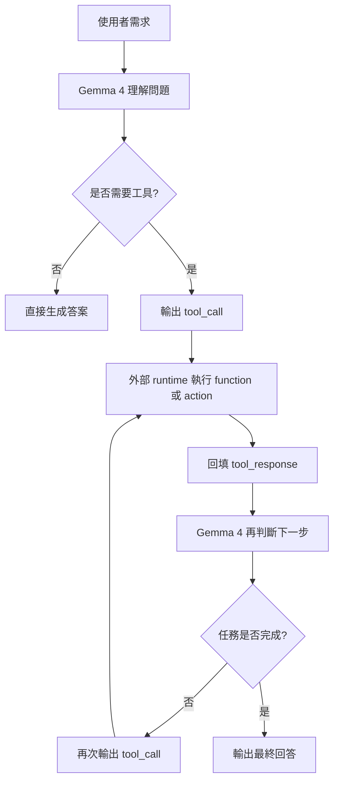
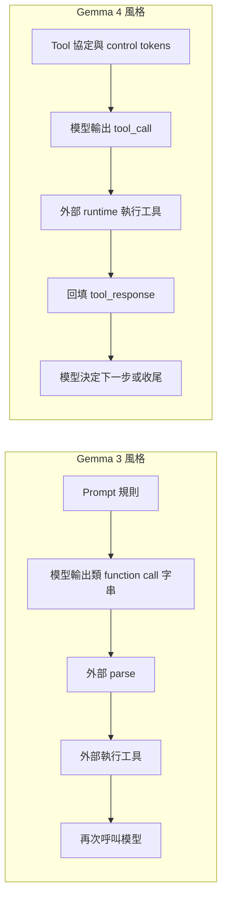
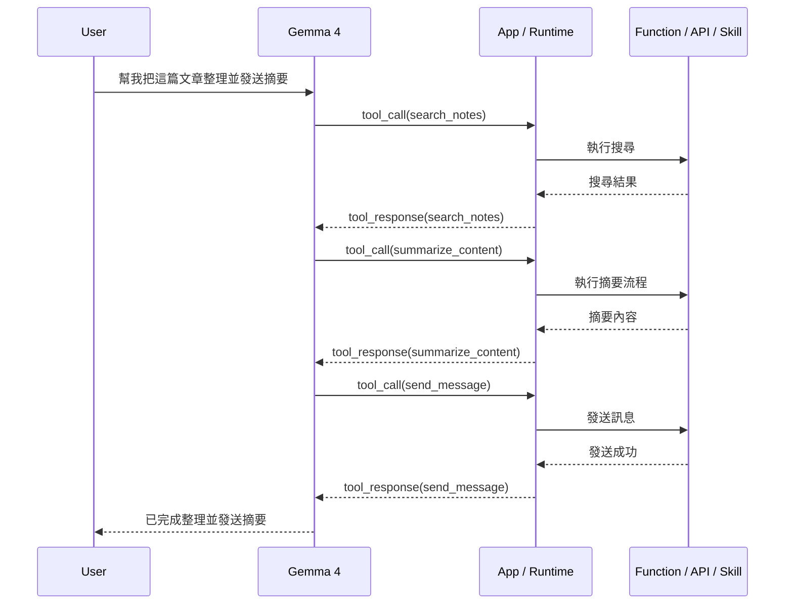
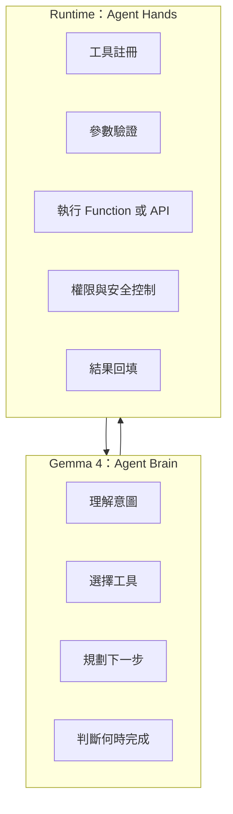
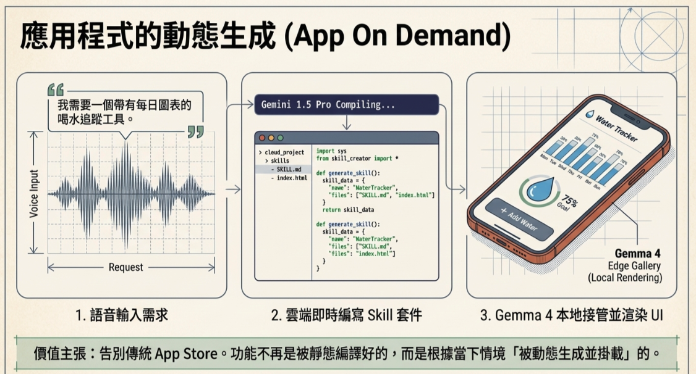

最近在看 Gemma 4 的文件時，我最有感的一點，不是它「能不能 function calling」，而是它把整件事往前推成了更完整的 **tool workflow / agentic workflow**。Google 在 Gemma 4 的 model card 裡，直接把它寫成 **原生支援 structured tool use，能啟用 agentic workflows**。這句話的重點，不在於它突然發明了工具呼叫，而是它讓模型更像一個可以主導任務流程的 **agent brain**。

很多人第一次看到這種描述，直覺會問：所以 Gemma 4 是不是已經能自己把所有工具都執行完，不再需要外部 loop？我認為最精準的答案是：**不是模型自己偷偷去執行世界上的動作，而是模型更擅長控制整個決策流程。** 它更會判斷什麼時候該用工具、要叫哪個工具、工具結果回來之後下一步要做什麼，以及什麼時候任務可以結束；但真正把 function、API、WebView、OS action 執行掉的，仍然是外部 app、runtime 或 agent framework。

# 為什麼 Gemma 4 值得談

Gemma 3 時代其實已經支援 function calling。你可以透過 prompt 規範輸出格式，讓模型吐出像函式呼叫的內容，再由外部框架去解析、執行、回填結果。這能做，而且很多系統本來就是這樣搭起來的。

但 Gemma 4 的進步在於，它開始把 **tool use lifecycle** 做成比較原生的協定。根據官方 prompt formatting 文件，Gemma 4 定義了像 `<|tool|>`、`<|tool_call|>`、`<|tool_response|>` 這樣的控制 token，用來描述工具宣告、工具呼叫與工具回應。這表示模型不只是「照 prompt 規則輸出 JSON」，而是更清楚自己正處在一個 **工具互動流程** 裡。

這個差異很關鍵。因為當模型知道自己在一個工具協定裡運作時，它就更容易穩定地完成這條鏈路：

1. 理解使用者需求
2. 判斷是否需要工具
3. 發出 tool call
4. 等待外部執行結果
5. 吸收 tool response
6. 決定下一步或收尾回答

這也就是為什麼 Google 會把 Gemma 4 的 function calling，不只描述成「可呼叫工具」，而是上升成 **agentic workflow**。

# Function Calling 與 Agentic Workflow 的差別

很多時候，這兩個詞會被混在一起，但我覺得它們最好拆開來看。

## Function Calling

這層能力的本質是：

- 模型知道目前需要某個工具
- 模型能正確輸出工具名稱與參數
- 外部系統收到後去執行

也就是說，**function calling 解決的是單次工具呼叫的格式與意圖表達**。

## Agentic Workflow

而 agentic workflow 多的，是這幾件事：

- 模型能依據上下文決定要不要用工具
- 工具跑完之後，模型知道要不要再接下一步
- 它能把多次工具呼叫串成一個任務流程
- 它能判斷什麼時候任務已經完成

也就是說，**agentic workflow 解決的是整個任務流程的控制權**。

從這張圖就可以看出來，**loop 並沒有消失**。只是以前這個 loop 比較像工程師自己在外面硬接；現在則比較像由 Gemma 4 主導決策，外部系統承接執行。

# Gemma 4 與 Gemma 3 的真正差異

如果要用一句話來總結，我會這樣寫：

> Gemma 3 比較像「會叫工具」，Gemma 4 比較像「會把工具呼叫串成工作流程」。
> 

這個差異不是說 Gemma 3 做不到，而是工程體感差很多。Gemma 3 的 function calling 比較像靠 prompt engineering 建出一條路；Gemma 4 則更像官方開始鋪設一條原生車道。

這就是我認為 Gemma 4 最值得談的地方：它沒有神奇到讓外部執行層消失，但它確實把 **模型作為 agent 大腦** 這件事做得更原生。

# 所謂的 LLM to Action，到底在講什麼

我很喜歡用 **LLM to Action** 來描述這一波演進。因為以前我們談 LLM，大多停在生成文字：寫文章、摘要、聊天、問答。但當模型開始能穩定地把自然語言轉成工具決策，再透過外部系統真的觸發 action 時，它扮演的角色就不一樣了。

它不再只是回答問題，而是開始成為：

- 任務拆解者
- 工具選擇者
- 工作流程控制者
- 動作規劃者

這也是為什麼 Gemma 4 會讓人感覺，**自然語言到實際操作的距離變短了**。不是因為它自己變成作業系統，而是因為它更擅長把語言轉成一連串可執行的決策。

這裡最核心的一句話是：

> **Gemma 4 推進的不是 action execution，而是 action orchestration。**
> 

也就是說，它強化的是決策與流程控制，而不是把所有執行責任從系統端拿走。

# 誰在控制整個流程

如果把責任分工拆清楚，整件事就會非常好理解。

## Gemma 4 負責的事

- 理解使用者意圖
- 判斷是否需要工具
- 選擇工具與填寫參數
- 產生最後的自然語言回答
- 根據工具回傳結果決定下一步
- 判斷任務何時完成

## 外部 Runtime 負責的事

- 註冊有哪些工具可用
- 驗證參數是否合法
- 決定哪些 function 允許被呼叫
- 真正執行 API、function、WebView、手機 action
- 控制 timeout、重試、權限與安全邊界
- 必要時限制最多可呼叫的步數

所以如果用最白話的方式說：

**Gemma 4 更像是 agent 的腦，而不是 agent 的手。**

# 這對 on-device AI 為什麼重要

如果這件事只發生在雲端，其實還不算真正有趣。Gemma 4 更值得關注的，是 Google 明顯想把這種能力帶到 **裝置端與邊緣端**。這也是為什麼你會在 Google AI Edge Gallery 與 LiteRT-LM 的材料裡，不斷看到 agentic workflows、tool use、on-device actions 這些關鍵字。

這背後意味著一件事：

未來的本地端模型，不只是離線聊天而已，而是有機會成為真正可以操作本地系統能力的控制中樞。舉例來說，它可以決定要不要呼叫某個 Android Skill、某個 WebView-based capability、某個本地 API、某個 app intent，然後再根據結果決定下一步。

這種模式一旦成熟，很多以前需要大量 if-else 與 rule engine 維護的操作流程，都可能被重新改寫成：

**自然語言輸入 -> 模型規劃 -> 工具執行 -> 回填 -> 完成任務**

# 一個更實際的理解方式

我現在會把 Gemma 4 放在這個位置來看：

- 它不是單純的聊天模型
- 它也不是會自動執行所有 action 的魔法引擎
- 它比較像是一個更成熟的 **workflow controller**

因此，與其問「Gemma 4 有沒有 function calling」，不如問：

**Gemma 4 能不能更好地把 function calling 串成一個任務完成系統？**

我的答案是：**可以，而且這正是它最有價值的地方。**

# 結語

如果只用一句話來總結我對 Gemma 4 的看法，我會這樣寫：

> **Gemma 4 的升級，不只是讓模型更會呼叫工具，而是讓模型更像一個能夠主導任務流程的 agent brain。**
> 

它不會取代外部 runtime，也不會讓 function execution 憑空消失；但它確實把「自然語言如何被轉成一連串可執行的動作流程」這件事，做得更原生、更明確，也更容易落地成產品。

對我來說，這才是 Gemma 4 真正有意思的地方：

**它讓 LLM 從只會生成文字，往更接近 Action Orchestration 的方向，又往前推了一大步。**

# 參考資料

- [Gemma 4 Model Card](https://ai.google.dev/gemma/docs/core/model_card_4)
- [Prompt formatting for Gemma 4](https://ai.google.dev/gemma/docs/core/prompt-formatting-gemma4)
- [Function calling with Gemma](https://ai.google.dev/gemma/docs/capabilities/function-calling)
- [Text function calling with Gemma 4](https://ai.google.dev/gemma/docs/capabilities/text/function-calling-gemma4)
- [LiteRT-LM Overview](https://ai.google.dev/edge/litert-lm/overview)
- [Bring state-of-the-art agentic skills to the edge with Gemma 4](https://developers.googleblog.com/bring-state-of-the-art-agentic-skills-to-the-edge-with-gemma-4/)
- [On-device function calling in Google AI Edge Gallery](https://developers.googleblog.com/on-device-function-calling-in-google-ai-edge-gallery/)