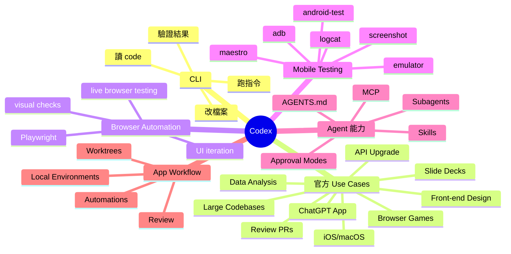

# Codex CLI

`Codex CLI` 對我來說最有價值的地方，是它不是把聊天介面搬到 terminal 而已，而是把整個 coding workflow 直接拉進 repo 現場。

## 它和一般聊天工具的差別

如果只是一般 chat 工具，很多時候你還是得自己：

- 複製檔案內容
- 描述專案結構
- 解釋目前上下文
- 手動把建議改回去

但 `Codex CLI` 這類工具比較強的地方是，它可以直接貼著目前 workspace 運作。

這代表它比較適合處理：

- 讀現有程式碼
- 修改檔案
- 跑指令
- 驗證結果
- 在同一個 repo 裡持續往前做

## 為什麼 CLI 形態很重要

對開發者來說，terminal 不是附屬品，而是工作主場之一。

當 AI 工具可以直接待在這個環境裡，你就比較容易把它視為真正的工作夥伴，而不是外掛問答視窗。

## 我會怎麼定位它

我會把 Codex CLI 看成：

- repo 內工作的 AI 助手
- terminal-first 的 coding agent 介面
- 適合直接做讀、改、跑、驗證的一條龍工具

如果需求是偏向實際改 code、理解專案與延續上下文工作，CLI 型態的價值會很明顯。

## 官方 use cases 在講什麼

根據 OpenAI 官方 `Codex Use Cases` 頁面，`Codex` 已經不是只拿來補幾行 code，而是被定位成可以承接多種工程與產品工作流的 agent。

截至 `2026-03-29`，官方頁面列出的代表性 use cases 包含：

- review pull requests
- build responsive front-end designs
- analyze datasets and ship reports
- bring your app to ChatGPT
- build for iOS and macOS
- create browser-based games
- generate slide decks
- iterate on difficult problems
- kick off coding tasks from Slack
- turn Figma designs into code
- understand large codebases
- upgrade your API integration

如果只看這份清單，可以很明顯感覺到它的定位已經從「code completion」走到「可執行工作流」。

## Playwright、android-test 與其他實戰功能

這裡我會把 `Codex` 的能力分成兩層看。

第一層是官方 use case 直接點名的情境。這裡最值得注意的是 `Create browser-based games` 這篇，官方明確把 `Playwright` 列成 skill，用來：

- 在 live browser 裡操作真實畫面
- 檢查目前 UI 狀態
- 反覆調整 controls、timing 與互動細節
- 讓 agent 不只寫前端，還真的去看與測

也就是說，`Playwright` 在 `Codex` 裡不是附屬工具，而是 browser automation / visual validation 工作流的一部分。

第二層是從 `Codex` 的工具機制往外延伸的 use case。像 `android-test` 目前不是官方 use-cases 頁面上的固定標題，但如果你把 `Codex` 接上 Android 測試相關工具，例如：

- `adb`
- `Maestro`
- emulator / simulator automation
- logcat / screenshot / UI hierarchy 檢查

那它其實很自然就能延伸成 Android app 測試與除錯助手。這一點比較像是根據 `Codex` 的 agent 模式、skills、MCP、tool calling 能力推導出的實務用法，而不是官方頁面逐字列出的名稱。

## 我認為最值得記住的 Codex 功能

除了 use cases，官方文件也透露出幾個很重要的核心能力：

- `CLI` 模式：適合在 repo 內直接讀、改、跑、驗證
- `App` 模式：有 review、automations、worktrees、local environments 等工作流支援
- `Skills`：把常做任務固定成可重複使用的流程模組
- `MCP / Connectors`：把外部工具、知識源與服務接進來
- `Subagents`：把任務拆成可平行處理的多工流程
- `Approval modes`：控制 agent 在什麼情況下需要先停下來詢問
- `AGENTS.md`：把專案規則、風格與工作守則固定下來

這些能力合在一起後，`Codex` 比較像是一個可配置的工程工作台，而不是單純的聊天視窗。

## 我自己很在意的另一個點：先 plan 再做

如果要講我自己最喜歡的使用方式，我會特別想補一句：

不要一開始就直接叫 `Codex` 寫。

我自己越來越喜歡先走 `plan mode` 這條線，讓它先透過幾輪短問題或規劃過程，把需求、限制、驗收條件和邊界先釐清。這種做法的價值，不只是降低返工，更重要的是你會重新站回規劃者的位置，而不是只是在旁邊看 AI 生 code。

如果把這件事放回更完整的工程方法，我會把它和 `SDD`、`spec kit`、`Mermaid`、`pseudo code` 一起看。這部分我另外整理成一篇心得：[Plan Mode、SpecKit 與 SDD：先把需求問清楚，再讓 AI 開始做](../../workflow/plan-mode-spec-kit-and-sdd.md)。

## Mermaid mindmap

下面這張圖比較接近我現在理解的 `Codex` 心智模型：

## 我的結論

如果只把 `Codex CLI` 看成「在 terminal 裡聊天」，其實會低估它很多。

比較準確的理解應該是：它是一個以 repo 為中心、可串工具、可執行流程、可驗證結果的 coding agent 介面。

而 `Playwright`、`android-test`、PR review、前端視覺驗證、文件整理、甚至多工具串接，都是這個定位自然延伸出來的 use cases。

## 參考資料

- [Codex Use Cases](https://developers.openai.com/codex/use-cases)
- [Create browser-based games](https://developers.openai.com/codex/use-cases/browser-games)
- [Codex CLI Features](https://developers.openai.com/codex/cli/features)
- [Codex App Features](https://developers.openai.com/codex/app/features)
- [Codex Skills](https://developers.openai.com/codex/skills)
