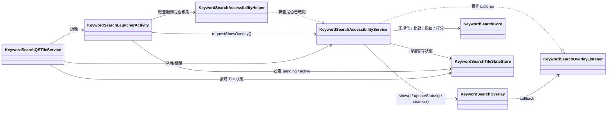
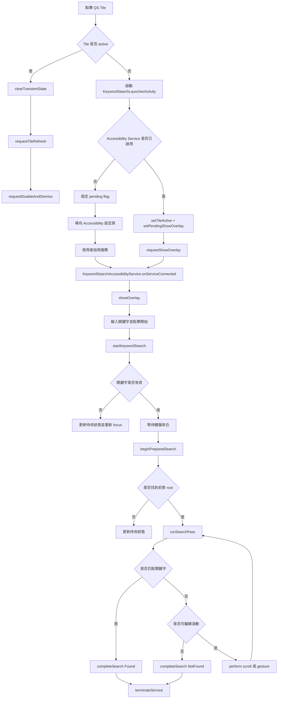
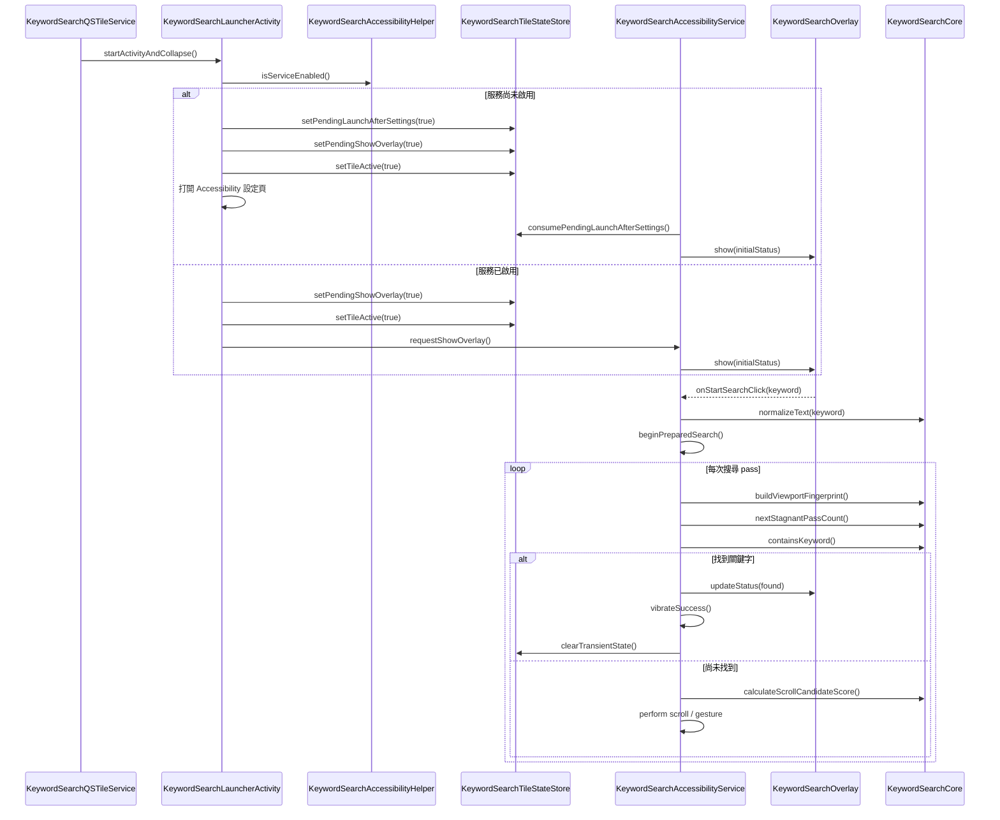
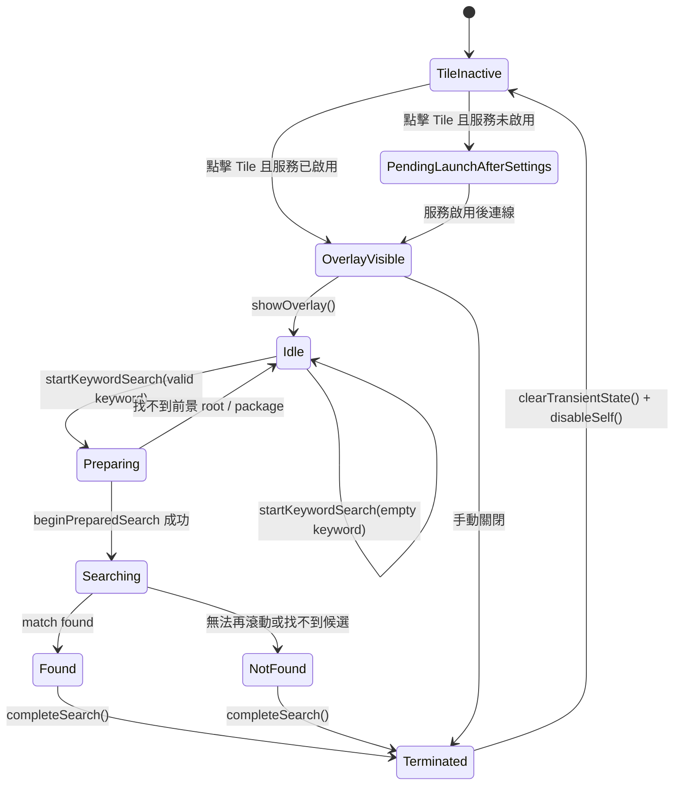
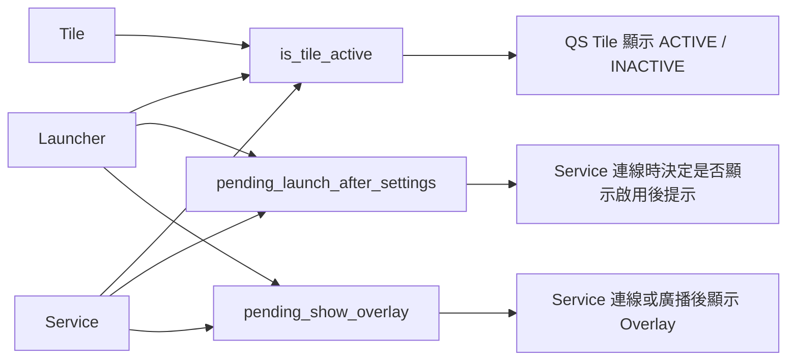

# Keyword Search Mermaid Diagrams

## 類別關係圖

```mermaid
classDiagram
    direction LR

    class KeywordSearchQSTileService
    class KeywordSearchLauncherActivity
    class KeywordSearchAccessibilityHelper
    class KeywordSearchAccessibilityService
    class KeywordSearchOverlay
    class KeywordSearchOverlayListener
    class KeywordSearchCore
    class KeywordSearchTileStateStore

    KeywordSearchQSTileService --> KeywordSearchLauncherActivity : 啟動
    KeywordSearchQSTileService --> KeywordSearchAccessibilityService : 停用/關閉
    KeywordSearchQSTileService --> KeywordSearchTileStateStore : 讀寫 Tile 狀態

    KeywordSearchLauncherActivity --> KeywordSearchAccessibilityHelper : 檢查服務是否啟用
    KeywordSearchLauncherActivity --> KeywordSearchTileStateStore : 設定 pending / active
    KeywordSearchLauncherActivity --> KeywordSearchAccessibilityService : requestShowOverlay()

    KeywordSearchAccessibilityService --> KeywordSearchOverlay : show() / updateStatus() / dismiss()
    KeywordSearchAccessibilityService --> KeywordSearchCore : 正規化 / 比對 / 指紋 / 打分
    KeywordSearchAccessibilityService --> KeywordSearchTileStateStore : 清理暫存狀態
    KeywordSearchAccessibilityHelper ..> KeywordSearchAccessibilityService : 檢查是否已啟用

    KeywordSearchOverlay --> KeywordSearchOverlayListener : callback
    KeywordSearchAccessibilityService ..|> KeywordSearchOverlayListener : 實作 Listener
```

## 啟動與搜尋流程圖

```mermaid
flowchart TD
    A[點擊 QS Tile] --> B{Tile 是否 active}
    B -- 是 --> C[clearTransientState]
    C --> D[requestTileRefresh]
    D --> E[requestDisableAndDismiss]

    B -- 否 --> F[啟動 KeywordSearchLauncherActivity]
    F --> G{Accessibility Service 是否已啟用}

    G -- 否 --> H[設定 pending flag]
    H --> I[導向 Accessibility 設定頁]
    I --> J[使用者啟用服務]
    J --> K[KeywordSearchAccessibilityService.onServiceConnected]

    G -- 是 --> L[setTileActive + setPendingShowOverlay]
    L --> M[requestShowOverlay]
    M --> K

    K --> N[showOverlay]
    N --> O[輸入關鍵字並點擊開始]
    O --> P[startKeywordSearch]
    P --> Q{關鍵字是否有效}
    Q -- 否 --> R[更新待命狀態並重新 focus]
    Q -- 是 --> S[等待鍵盤收合]
    S --> T[beginPreparedSearch]
    T --> U{是否找到前景 root}
    U -- 否 --> V[更新待命狀態]
    U -- 是 --> W[runSearchPass]
    W --> X{是否匹配關鍵字}
    X -- 是 --> Y[completeSearch Found]
    X -- 否 --> Z{是否可繼續滾動}
    Z -- 否 --> AA[completeSearch NotFound]
    Z -- 是 --> AB[perform scroll 或 gesture]
    AB --> W
    Y --> AC[terminateService]
    AA --> AC
```

## 互動時序圖

```mermaid
sequenceDiagram
    participant Tile as KeywordSearchQSTileService
    participant Launcher as KeywordSearchLauncherActivity
    participant Helper as KeywordSearchAccessibilityHelper
    participant Store as KeywordSearchTileStateStore
    participant Service as KeywordSearchAccessibilityService
    participant Overlay as KeywordSearchOverlay
    participant Core as KeywordSearchCore

    Tile->>Launcher: startActivityAndCollapse()
    Launcher->>Helper: isServiceEnabled()

    alt 服務尚未啟用
        Launcher->>Store: setPendingLaunchAfterSettings(true)
        Launcher->>Store: setPendingShowOverlay(true)
        Launcher->>Store: setTileActive(true)
        Launcher->>Launcher: 打開 Accessibility 設定頁
        Service->>Store: consumePendingLaunchAfterSettings()
        Service->>Overlay: show(initialStatus)
    else 服務已啟用
        Launcher->>Store: setPendingShowOverlay(true)
        Launcher->>Store: setTileActive(true)
        Launcher->>Service: requestShowOverlay()
        Service->>Overlay: show(initialStatus)
    end

    Overlay-->>Service: onStartSearchClick(keyword)
    Service->>Core: normalizeText(keyword)
    Service->>Service: beginPreparedSearch()
    loop 每次搜尋 pass
        Service->>Core: buildViewportFingerprint()
        Service->>Core: nextStagnantPassCount()
        Service->>Core: containsKeyword()
        alt 找到關鍵字
            Service->>Overlay: updateStatus(found)
            Service->>Service: vibrateSuccess()
            Service->>Store: clearTransientState()
        else 尚未找到
            Service->>Core: calculateScrollCandidateScore()
            Service->>Service: perform scroll / gesture
        end
    end
```

## 狀態圖

```mermaid
stateDiagram-v2
    [*] --> TileInactive

    TileInactive --> PendingLaunchAfterSettings: 點擊 Tile 且服務未啟用
    TileInactive --> OverlayVisible: 點擊 Tile 且服務已啟用

    PendingLaunchAfterSettings --> OverlayVisible: 服務啟用後連線
    OverlayVisible --> Idle: showOverlay()
    Idle --> Preparing: startKeywordSearch(valid keyword)
    Idle --> Idle: startKeywordSearch(empty keyword)
    Preparing --> Searching: beginPreparedSearch 成功
    Preparing --> Idle: 找不到前景 root / package
    Searching --> Found: match found
    Searching --> NotFound: 無法再滾動或找不到候選
    Found --> Terminated: completeSearch()
    NotFound --> Terminated: completeSearch()
    OverlayVisible --> Terminated: 手動關閉
    Terminated --> TileInactive: clearTransientState() + disableSelf()
```

## TileStateStore 旗標關係圖

```mermaid
flowchart LR
    A[is_tile_active] --> D[QS Tile 顯示 ACTIVE / INACTIVE]
    B[pending_launch_after_settings] --> E[Service 連線時決定是否顯示啟用後提示]
    C[pending_show_overlay] --> F[Service 連線或廣播後顯示 Overlay]

    Launcher --> A
    Launcher --> B
    Launcher --> C
    Service --> A
    Service --> B
    Service --> C
    Tile --> A
```

