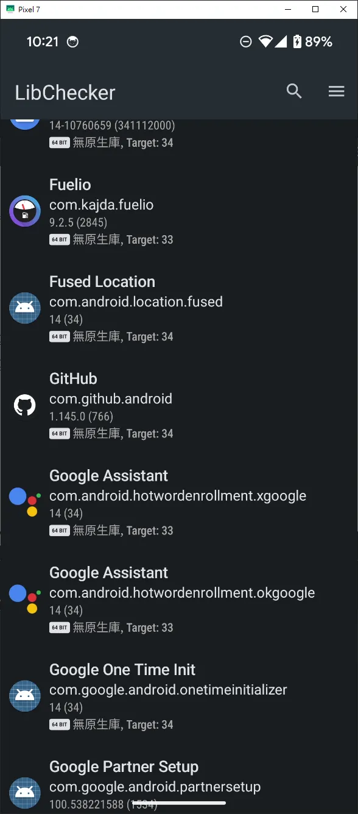

android opensource libchecker 大推 分析工具

Android — LibChecker 一個用來檢查你裝置上App使用什麼函示庫的工具

有時候你想窺探其他App開發是使用了那些套件，會需要透過反編譯去查看，會有點麻煩，其實有這麼一個App可以直接點選後查看你手機中 APP使用的函示庫，而且相當完整清楚

而且他是Open

Write on Medium
[https://github.com/LibChecker/LibChecker?tab=readme-ov-file](https://github.com/LibChecker/LibChecker?tab=readme-ov-file)

[https://github.com/LibChecker/LibChecker?tab=readme-ov-file](https://github.com/LibChecker/LibChecker?tab=readme-ov-file)

有興趣的可以試試看