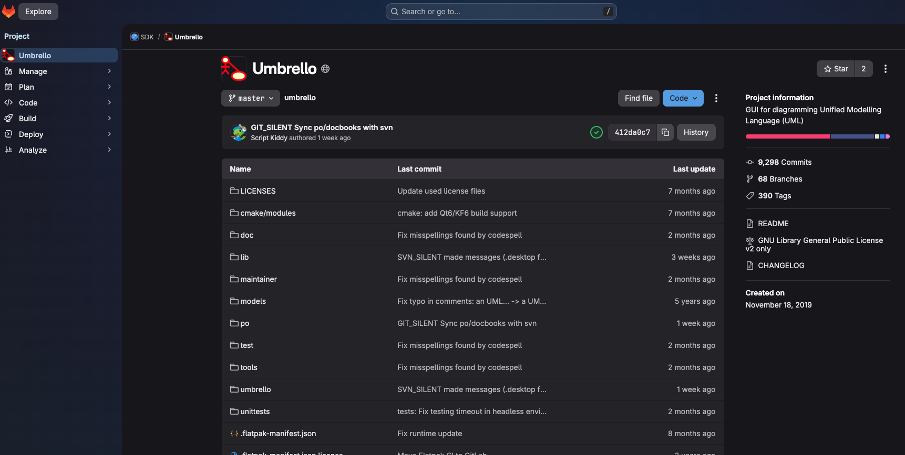
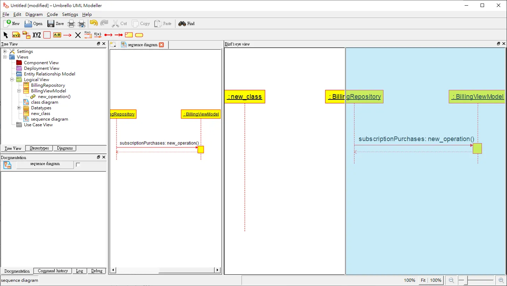

code uml umbrello opensource 

一個免費又好使用的GUI UML工具 — Umbrello

https://invent.kde.org/sdk/umbrello?source=post_page-----22669447517c---------------------------------------

Press enter or click to view image in full size

Umbrello
UML Modeller
apps.kde.org

由於最近在研究一個架構，找了很多工具，一開始想說PlantUML具有文字描述的特性，也可以將之放入git中，或者原始程式碼中，就可以跟程式碼同步，但找了非常多就是沒有支援直接拖拉的工具，或者很多都只是簡單的幾何圖形拖拉，需要花費許多時間拉 元件，索性就放棄了那些工具，譬如drawio 等等，而更好的當然是可以直接從程式碼產生class ，或者由圖表產生程式碼

正當要放棄時候，發現了這一套很不起眼的軟體Umbrello

由ChatGpt撰寫的介紹

“Umbrello UML 建模工具是一個免費開源的統一建模語言 (UML) 建模工具，可用於 Linux、macOS 和 Windows。它支持所有標準的 UML 圖表類型，包括類圖、序列圖、協作圖、狀態圖、活動圖、組件圖、佈署圖和實體關係圖。

Umbrello 可以用來繪製 class diagram 和序列圖。class diagram 用於描述軟件系統中的類和它們之間的關係。序列圖用於描述對象之間的互動。

Umbrello 還支持將程式碼匯出匯入功能。這可以幫助軟件開發人員將 UML 模型轉換為程式碼，或者將程式碼轉換為 UML 模型。”

大概就是有上面的內容，主要就是可以匯入程式碼進而產生，而且支援的程式碼語言還不少，重點還是open source，而且支援多種平台，可以上官網下載安裝檔，還沒仔細測試過，有興趣可以先去安裝看看。

Write on Medium
另外因為他只有支援Java沒有支援kotlin，目前想到的方法就是把apk先build起來，在自行透過反組的軟體將之編回成java，有成功在來更新囉

測試透過import from decompile後的kotlin成為java，可以正常的import

不過畢竟是反組的結果，會有一些匿名類別等等的產生，

Press enter or click to view image in full size

而且看起來非商用軟體，會有一些小問題，譬如剛匯入的時候無法直接使用，應該是bug，需要關閉在打開，這時候就可以從左邊的class清單拖拉到右邊的class diagram了，也許未來他可以支援產生plantUML，就交互性就更棒了，看了一下他的source code，很多都是由C++ 撰寫的

參考

Umbrello - 維基百科，自由的百科全書
Edit description
zh.wikipedia.org

SDK / Umbrello · GitLab
GUI for diagramming Unified Modelling Language (UML)
invent.kde.org

2

https://invent.kde.org/sdk/umbrello?source=post_page-----22669447517c---------------------------------------