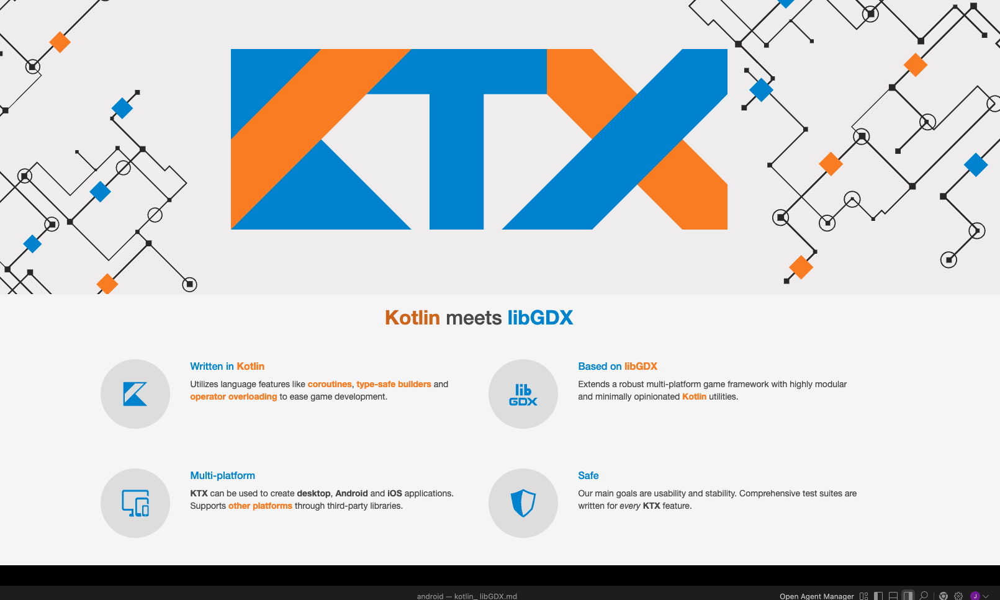

似乎libGDX是一個圖型lib，個人不是很了解，不過在找kotlin時候看到了有人寫成的

kotlin meets libGDX
KTX: Kotlin support for LibGDX applications
Kotlin extensions for LibGDX game framework.
libktx.github.io

Press enter or click to view image in full size

看一下他的特色，似乎很厲害

Press enter or click to view image in full size
https://libktx.github.io/?source=post_page-----1745afb72ab2---------------------------------------

看起來可以跨平台desktop / android /ios等等，下面也有許多範例可參考

Press enter or click to view image in full size

於是我就找了一個恐龍遊戲Dinoleon來試試

GitHub - Quillraven/Dinoleon: A small game using Fleks Entity Component System.
Dinoleon is an example game using Fleks entity component system in a LibGDX game. It is a very small and simple game…
github.com

一開始沒有待多的期待，因為通常這種專案可能用intellJ跑起來後都會有一些gradle或者build script的錯誤，但沒想到我看github專案更新再24天前，等於才更新沒多久

Become a Medium member
下載後打開build ，一路都超級順利，只有再找怎麼執行花了點時間，可以在右邊的

gradle -> application -> run
Press enter or click to view image in full size

另外可看到這個專案的主要為

/lwjgl3
還有

/core
還有

/assets
主要就是/core了

這裡面又是一套framework要熟悉，有興趣的人再去自己研究吧，但可以說kotlin能做到的事情真的是越來越多

遊戲可以選難易度，但有點不太直覺，使用

Q / W/ E / R 分別代表四個顏色，你必須再通過光棒的時候換成一樣的顏色，可是Q其實是紅色R是橘色??

不過這只是一個簡單的小示範，build 起來時間也很快，如果你有興趣有做game，就可以參考看看囉。