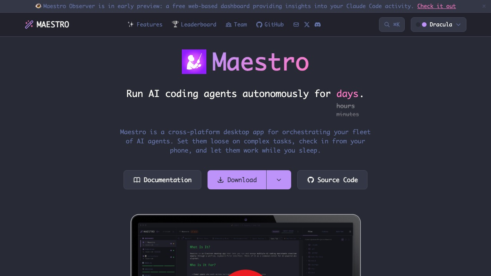

# RunMaestro AI

## 工具簡介

`RunMaestro.ai` 這個 `Maestro`，不是我原本熟悉的那個 mobile UI 測試工具，而是另一個完全不同方向的桌面 App。

它比較像一個 AI coding agent 的 orchestration command center。你可以把 `Codex`、`Claude Code`、`OpenCode` 這些 agent 放進同一個介面裡管理，讓它們各自跑不同工作，甚至長時間自動執行。

我第一眼會注意它，是因為它不是走「所有事情都得上官方雲端」的路線。官方文件寫得很明白，它本質上是 provider 的 pass-through：你原本在 agent 裡配置好的 MCP、skills、權限與認證，進到 Maestro 後還是沿用原本那套，只是把互動模式變成更適合批次執行與多工作管理的桌面工作台。

## 我為什麼會想記這個

我會把它另外記一篇，是因為這名字真的很容易跟原本的 `mobile-dev-inc/maestro` 搞混。

如果你要的是 Android / iOS UI automation，那還是看我原本那篇 [`Maestro`](maestro.md) 比較對路。

但如果你要的是：

- 同時開很多個 AI coding agent session
- 用 desktop app 管理長時間自動執行
- 想從手機遠端看 agent 跑到哪
- 想保留本機 agent 的工具鏈、MCP 與權限設定

那 `RunMaestro.ai` 反而是另一條很值得追的產品線。

## 主要用途

- 同時管理多個 AI coding agent
- 把 checklist / spec / playbook 丟給 agent 自動批次執行
- 做長時間 unattended run
- 用 worktree 把同一個 repo 分支開成平行工作
- 用手機遠端查看 agent 狀態
- 用 CLI 跑 headless workflow

## 我覺得它特別有意思的地方

### 1. 它不是另外發明一套封閉 agent

這點我自己很在意。

官方文件提到它支援的方向是把既有 agent 接進來，目前明確列出的整合對象包含 `Claude Code`、`Codex`、`OpenCode`、`Factory Droid`，另外還提到 `Gemini CLI` 與 `Qwen3 Coder` 是 planned support。

這代表它比較像一層 orchestration UI，而不是把你原本的工作流全部改寫掉。

### 2. 它把本機 agent 工作流做成比較完整的操作台

官網列出的功能其實蠻完整，像是：

- `Auto Run & Playbooks`
- `Mobile Remote Control`
- `Command Line Interface`
- `Multi-Agent Support`
- `Group Chat`
- `Git + Worktrees`
- `Session Discovery`

這些功能合在一起看，就不是單純「幫 AI 包個皮」而已，而是明顯想把本地 agent 變成一個可以長時間操作、追蹤、切換與管理的桌面環境。

### 3. 它把遠端控制這件事做得很實際

官網直接寫它有 built-in web server 與 QR code access，可以從手機控制 agent，還能選擇走 local network 或 Cloudflare tunnel。

這點很像是在補 AI agent 常見的一個缺口：工作一跑下去就很長，但人不一定一直坐在桌前。

### 4. 它連 open source 貢獻流程都想包進去

`Maestro Symphony` 這個功能我覺得蠻妙。它想做的是把 open source issue、Auto Run 文件、agent session、branch、draft PR 這整條流程串起來，讓使用者用 token 和本機算力去幫專案跑 AI-assisted contribution。

這個概念不一定每個人都會真的用，但方向很有辨識度。

## 我覺得特別適合的情境

- 你平常就有在用 `Codex` 或 `Claude Code`
- 你想把 agent 從單一 terminal 升級成多 session 工作台
- 你會同時顧很多 repo 或很多 feature branch
- 你想讓 agent 長時間自己跑，但又希望途中能看狀態
- 你不想把整套能力綁死在某個官方 SaaS workflow

## 補充筆記

- 它是 cross-platform desktop app，不是 Android 測試框架。
- GitHub repo 目前是 `AGPL-3.0`。
- 官方 repo 說明裡提到它已支援 `Claude Code`、`OpenAI Codex`、`OpenCode`、`Factory Droid`。
- 官方文件安裝頁有寫可以直接下載 macOS、Windows、Linux 版本，也可以從 source build。
- 目前看起來它的核心價值比較偏向「把本機 AI coding agent 生態整理成一個真的可操作的 command center」。

## 我自己的簡短評價

如果只看名字，我本來會以為它只是蹭原本 `Maestro` 品牌感的另一個工具。

但實際看完官網、文件跟 repo 之後，我覺得它不是那種只包一層行銷 UI 的東西，而是真的有把多 agent、長時間執行、remote control、CLI、worktree 這些拼成一個完整系統。

我現在對它的興趣點，不是把它當「AI 幫你寫 code」這麼簡單，而是把它看成一種 local-first agent operations UI。

如果之後我要把 `Codex`、本地工具、MCP、repo worktree 跟手機遠端控制串成一套穩定工作流，這個方向很值得再實跑一次。

## GitHub 來源

- 官方網站: [runmaestro.ai](https://runmaestro.ai/)
- 官方文件: [docs.runmaestro.ai](https://docs.runmaestro.ai/)
- 官方 repo: [RunMaestro/Maestro](https://github.com/RunMaestro/Maestro)
- Release 下載頁: [GitHub Releases](https://github.com/RunMaestro/Maestro/releases)

## 來源說明

這篇主要根據官方網站、官方文件與 GitHub repo 整理。

官方網站把它定位成一個可以讓 AI coding agents 自動執行數小時甚至數天的 desktop app；官方文件則補充了它目前支援的 agent、生產環境安裝方式，以及它是 pass-through orchestration layer 這件事；GitHub repo 則直接把它描述成一個 AI agents 與 projects 的 orchestration command center。
