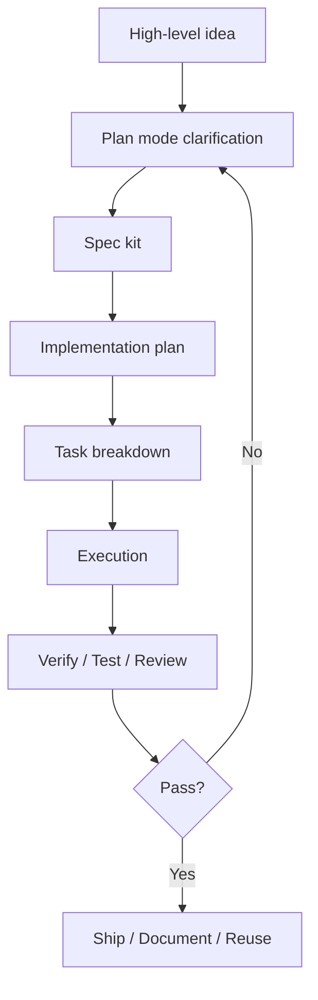

# Plan Mode、SpecKit 與 SDD：先把需求問清楚，再讓 AI 開始做

我最近越來越強烈地感覺到，未來 AI coding 真正有價值的地方，不是「它能不能一口氣幫我寫出很多 code」，而是它能不能先幫我把需求釐清、把邊界釘住、把驗收條件整理好，再開始往下做。

如果沒有這一層，很多時候你其實只是在把模糊需求丟給一個很會生內容的模型，最後得到一個看起來很完整、但不一定真的符合你要的東西。

所以我現在越來越重視一件事：

不要一開始就讓 AI 直接寫，而是先進入 `plan mode`，先把需求問清楚。

## 為什麼我會特別重視 plan mode

我覺得 `plan mode` 最有價值的地方，是它會逼你先停下來思考。

像我自己在 `Codex` 裡使用 plan mode 的感受是，它很適合在任務一開始先透過選單式、分批的短問題來釐清需求。不是直接一句 prompt 丟出去，而是先把下面這些事情問清楚：

- 你真正想解的是什麼問題
- 你想先求穩，還是先求快
- 哪些地方可以自由發揮
- 哪些地方不能碰
- 驗收的標準到底是什麼

這種感覺很像一個工程夥伴先把 spec interview 做完，再進入實作。

它的價值不只是「多問幾句」，而是把原本很容易模糊的需求，轉成可以被規劃、可以被 review、可以被驗證的工作材料。

## 這其實已經不是 prompt，而是 spec kit

我自己現在越來越不把這件事看成「prompt 寫得好不好」。

比較像是：

你有沒有辦法整理出一份夠好的 `spec kit`。

我這裡說的 `spec kit`，不是特定產品的專有名詞，而是我自己對一整包規格材料的理解。它可能包含：

- 問題定義
- 目標與非目標
- 系統邊界
- 模組責任
- 資料流與流程圖
- domain 名詞
- 驗收標準
- 測試策略
- pseudo code
- `Mermaid` 圖

也就是說，未來我們不是只在學怎麼下 prompt，而是在學怎麼把自然語言需求工程化。

這件事對我來說很像一種新的工程能力。

以前我們會學：

- design pattern
- DDD
- clean architecture
- testing strategy

現在則要再多補一塊：

- 如何用自然語言、圖表、範例與邊界定義，把 AI 限定在正確框架裡工作

## 我為什麼會覺得這跟 SDD 非常像

因為 `Spec-Driven Development` 的核心，本來就不是「多寫一份文件」。

它真正的重點是：

- 先定義 spec
- 再提出 plan
- 再分解 task
- 再進入實作
- 最後用驗收與測試收斂

如果從這個角度看，plan mode 根本就是 `SDD` 非常自然的一個入口。

它把原本只存在你腦中的模糊想法，先收斂成可對話的規格，再讓 AI 往下施工。

所以我現在的理解是：

`plan mode` 不是附屬功能，而是把 `SDD` 落地到 AI 工作流裡的第一步。

## 不同平台名稱不同，但方向其實很接近

這也是我最近很有感的一點。

現在不只是單一工具在做這件事，而是很多 IDE 或 agent 平台都開始往這個方向靠。

### Codex

以我目前的使用經驗來看，`Codex` 的 plan mode 很適合在正式執行前，先用選單式問題把需求釐清。這個過程的好處，是你不需要一次把所有事情講完，而是可以透過幾輪互動，把真正重要的限制條件慢慢補齊。

這種互動方式很有參與感，因為你不是把任務整包外包出去，而是一路在做共同規劃。

### Antigravity

`Antigravity` 這邊我覺得更明顯。官方 codelab 直接把流程拆成 `Implementation Plan` 和 `Task List`。

也就是說，它不是一句話就直接開工，而是先把：

- 目標
- 技術選型
- 預計修改方向
- 任務清單

列出來給你 review。你甚至可以在 implementation plan 階段就回頭改它，例如要不要換 tech stack、要不要調整方向、要不要補限制條件。

### Android Studio

`Android Studio` 目前官方是用 `Agent Mode` 這個名稱。它的描述也很接近這條線：你先描述高階目標，agent 先建立 plan，再去呼叫工具、修改多個檔案、反覆修正，並且在過程中讓你 review 和 approve 變更。

這裡我覺得很重要的是，雖然不同平台的命名不一定都叫 `plan mode`，但它們正在做的事情其實很像：

先讓你思考，再讓 AI 動手。

## 比起直接生 code，這種方式為什麼更好

如果你一開始就直接叫 AI 開做，通常得到的會是：

- 它先用自己的理解補完很多空白
- 你看到結果後才發現方向不對
- 然後開始反覆修 prompt
- 一邊改，一邊補需求
- 最後花很多時間在返工

但如果你先走 plan / spec 這條線，流程會變成：

- 先釐清需求
- 先看 plan
- 先確認範圍與邊界
- 再開始實作
- 做完再驗收

這樣不只品質比較穩，連你自己也會更知道自己在做什麼。

而且最重要的是，你不會變成只是站在旁邊看 AI 表演。

你會重新回到工程流程裡最有價值的位置：

- 定義目標
- 管理邊界
- 設計規格
- 確認品質

## 我現在會希望 spec kit 至少有什麼

如果今天是一個稍微有複雜度的功能，我會希望至少有下面這些材料：

- 問題定義：這次到底要解什麼
- 目標與非目標：做什麼、不做什麼
- 系統邊界：哪些模組能改、哪些不能動
- 架構方向：是不是要符合現有分層或 design pattern
- domain 詞彙：重要名詞先對齊
- 流程圖：用 `Mermaid` 把資料流、事件流或互動畫出來
- pseudo code：把核心邏輯先描述清楚
- 驗收標準：最後怎麼知道它真的做對
- 測試策略：單元測試、整合測試、UI 測試要怎麼補

如果你把這些東西先整理好，再交給 AI，它能自由發揮的空間會更健康。

不是把它綁死，而是給它一個可控的創作邊界。

## Mermaid：我覺得非常值得放進 spec kit

我自己越來越覺得，`Mermaid` 在這個時代很有價值。

因為很多需求如果只用自然語言描述，其實很容易誤會。但只要你補一張圖，像是：

- flowchart
- sequence diagram
- state diagram
- architecture sketch

很多模糊地帶會立刻變清楚。

例如下面這張圖，就很接近我現在理解的 `plan mode → spec → execute → verify` 心智模型：

這種圖非常適合拿來做：

- 任務交接
- AI 上下文補充
- 架構溝通
- 驗收前確認

## 這讓我想到一件事：未來要學的可能是自然語言 pattern

我現在越來越覺得，我們以前在軟體工程裡學的很多東西，接下來不會消失，反而會變得更重要。

像：

- design pattern
- DDD
- domain modeling
- 測試
- 邊界定義
- 架構分層

這些在 AI 時代不是過時，而是會變成你限制 AI、引導 AI、驗收 AI 的基礎。

只是表達形式多了一層：

你不只是在設計 code 結構，也是在設計 AI 可以遵守的自然語言框架。

換句話說，未來很可能不只是學 design pattern，也會學怎麼寫給 AI 的 pattern。

這不是取代軟體工程，而是把軟體工程往更高一層抽象推上去。

## 我接下來會想繼續補的方向

這一塊我自己很確定還會持續整理，因為我覺得它會越來越重要。

後面我想再慢慢補：

- 不同工具的 plan mode 差異
- spec kit 最小模板
- Mermaid / pseudo code 怎麼搭配
- 如何把 DDD / testing / architecture decision 寫進 AI 可用規格
- 怎麼讓 acceptance criteria 更能被 agent 執行與驗證

我自己現在的結論很簡單：

不要急著叫 AI 開做。

先把需求問清楚、邊界釘清楚、驗收講清楚，再讓它進場。

這不只是比較穩，也更像真正的工程。

## 延伸閱讀

- [Coding 的 SDD：Spec-Driven Development 與 Design Document 的差異](../design/spec-driven-development.md)
- [不要當 code monkey：我在 GDG Taipei 聽完 Antigravity 與 Spec-Driven Development 的心得](android-gdg-taipei.md)
- [Codex CLI](../ai/openai/codex-cli.md)
- [Google Anti-gravity](../ai/google/google-antigravity.md)

## 參考資料

- [Codex App Features](https://developers.openai.com/codex/app/features)
- [Agent Mode | Android Studio](https://developer.android.com/studio/gemini/agent-mode)
- [Google Antigravity Codelab](https://codelabs.developers.google.com/getting-started-google-antigravity)
